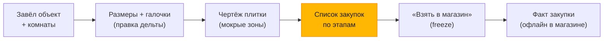
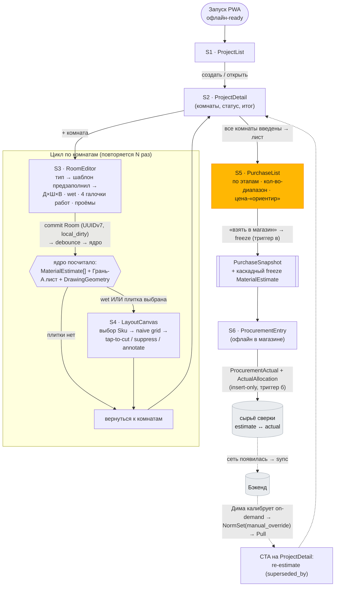

# 08 · UX и потоки: экраны, модель ввода, принципы

UX живёт **поверх** принятых решений (D1–D10, гл. 04) и контракта ядра (гл. 05 §8) —
не меняет их и не вводит новых сущностей данных. Каждый экран — это вид на сущности
гл. 05 и узел маршрута из гл. 09 §1. Эта глава закрывает **Open Q4** (модель ввода) и
фиксирует, как честная неопределённость (D7, гл. 07) показывается прорабу.

Визуальные макеты ключевых экранов — `docs/design/08-mockups/index.html`
(self-contained, открывается в браузере; стек продакшена — React + императивный Canvas,
гл. 09 ①).

---

## 0. UX-тезис (одним взглядом)

**«Нажал — получил лист».** Прораб Давид в операционке, на объекте, часто без сети,
часто в перчатке. Три силы определяют каждый экран:

1. **Минимум ввода (П3).** Шаблон по типу комнаты предзаполняет состав работ и нормы;
   прораб правит только **дельту**. Ввод — это геометрия (Д×Ш×В) + несколько галочек,
   не анкета.
2. **Честная неопределённость (D7).** Везде, где число неточно, показываем **диапазон**
   и метку «ориентир / уточни по факту», а не ложно-точную цифру. Два **разных** уровня
   доверия (норма vs количество в листе) — §4.
3. **Офлайн под палец.** Всё работает без сети (гл. 09 §4); крупные таргеты; ненавязчивый
   индикатор синка (OfflineBadge); минимум текста.

Воронка к ценности — список закупок (выделен). Всё до него — минимально-необходимый
ввод; всё после — сверка факта, питающая калибровку (Risk #1).

---

## 1. Карта экранов

Шесть маршрутов оболочки (гл. 09 §1, AppShell + Router) + сквозной слой. Каждый экран
владеет конкретными сущностями гл. 05 — **новых сущностей UX не вводит**.

| # | Экран | Роль | Владеет / читает (гл. 05) | Главный выход |
|---|---|---|---|---|
| S1 | **ProjectList** | вход, список объектов | `Project[]` (read) | выбор/создание объекта |
| S2 | **ProjectDetail** | хаб объекта: комнаты, статус, итог, калибровка | `Project`, `Room[]`, агрегат `MaterialEstimate`; CTA re-estimate под новой `NormSet` | переход к комнатам / к листу |
| S3 | **RoomEditor** | **единственный человекозаполняемый вход** | `Room` (+ embedded `WorkSelection[]`, `Opening[]`), `RoomTemplate` (предзаполнение) | геометрия + состав работ → триггер ядра |
| S4 | **LayoutCanvas** | редактируемый чертёж плитки (D8) | `LayoutState`, `CutOverride[]`, выбор `Sku`; рендер `DrawingGeometry` | раскладка + ручные подрезки |
| S5 | **PurchaseList** | список закупок по этапам + freeze | Грань-A `PurchaseList` (ephemeral), `PurchaseSnapshot` (freeze) | лист «в магазин» |
| S6 | **ProcurementEntry** | факт закупки (часто офлайн в магазине) | `ProcurementActual`, `ActualAllocation` | сырьё сверки (Risk #1) |

**Сквозной слой (в каждом экране):**
- **OfflineBadge / SyncStatus** в шапке — online/offline, счётчик непушнутых правок,
  неблокирующий тост при конфликте/tombstone (гл. 09 ① OfflineBadge).
- **NormRangeView** — переиспользуемый презентационный компонент честной неопределённости
  нормы (§4), всплывает в норм-вью/тултипе допущений, **не** в строках листа.
- **Loading-skeleton** «считаю…» пока Promise ComputeClient не зарезолвился (гл. 09 §4).

Маршрут — линейная цепь с возвратами:
`ProjectList → ProjectDetail → RoomEditor → LayoutCanvas → PurchaseList → ProcurementEntry`
(гл. 09 §1). Калибровочный CTA (re-estimate под новой `NormSet`) живёт на **ProjectDetail**,
не отдельным экраном на пилоте.

---

## 2. Флоу-диаграмма

Пользовательский поток с привязкой переходов к событиям данных (нумерация фаз — гл. 09 §3).

Сплошные стрелки — действия прораба офлайн; пунктир — то, что происходит при появлении
сети и при ручной калибровке (замыкание петли Risk #1, гл. 09 §3 фаза 9). Калибровка —
**не** разомкнутая стрелка: новая `NormSet` доезжает как global reference и предлагает
re-estimate на ProjectDetail.

---

## 3. Модель ввода — решение **Open Q4**

### 3.1 Постановка

Q4 (гл. 04 / гл. 06): *каков минимальный набор галочек «состав работ», покрывающий ~80%
объектов Давида, чтобы прораб не заполнял анкету, а правил предзаполненную дельту?*
Слишком мало галочек — движок не покроет реальный объект; слишком много — ввод
превращается в форму, которую на стройке никто не заполняет (нарушение П3).

### 3.2 Решение

**Состав работ = ровно 4 галочки на комнату — по `WorkKind` (гл. 05 §2) — плюс один
явный флаг `wet`. Всё предзаполняется шаблоном по `RoomType`; прораб правит дельту.**

Это не новая модель — это прямое отображение `WorkSelection` (tagged union, гл. 05 §2):

| Галочка (WorkKind) | `enabled` | Минимальный параметр (предзаполнен, правится дельтой) |
|---|---|---|
| **Пол** | bool | `floor_finish ∈ {tile, laminate, vinyl, none}` |
| **Стены** | bool | `paint_coats` (default 2) **или** плитка (если `wet`) |
| **Потолок** | bool | `paint_coats` (default 2) |
| **Электрика** | bool | `electric_points {sockets, switches, lights}` — счётчики по шаблону |
| *(не галочка работ)* **Мокрая зона** | `Room.wet: bool` | включает ветку **гидроизоляция + плитка**; драйвит этапы waterproofing/tiling |

Семантика галочки — это `WorkSelection.enabled`; запись **сохраняется и при выключении**
(provenance шаблона, гл. 05 §2). Параметры варианта (`floor_finish`, `tile_pattern`,
`paint_coats`, `electric_points`) — то, что прораб правит **дельтой** поверх предзаполнения;
`tile_pattern` на пилоте фиксирован `straight`/`grid` (solver — фаза 2).

**Почему `wet` — отдельный явный вход, а не вывод из типа.** Кухня бывает без плитки на
стенах, санузел — всегда мокрый, но «постирочная» неоднозначна. `Room.wet` — **явный**
вход прораба (гл. 05 §2: «не вывод из type»); тип лишь даёт дефолт, который прораб
перекрывает одним тапом. Это ловит самый дорогой класс ошибки нормы (пропущенная
гидроизоляция = переделка).

### 3.3 Почему 4 галочки = ~80% объектов Давида

Давид делает ремонт квартир в Лиссабоне. «Объект» = набор комнат шести типов
(`RoomType{bathroom, kitchen, bedroom, living, hallway, other}`). Каждая комната
раскладывается в **те же 4 оси работ**, а 4 оси × `wet` детерминированно драйвят 8
канонических этапов (гл. 02 / гл. 05 §5 `Stage`):

| Ось ввода | → драйвит этап(ы) | → материалы (через `NormRule`) |
|---|---|---|
| (объект целиком) | demolition | демонтаж |
| Электрика + (wet→) сантехника | rough_plumbing_electric | подрозетники, кабель-точки, трубы-точки |
| Пол | screed | стяжка / ровнитель |
| wet | waterproofing | гидроизоляция мокрых зон |
| Пол=tile / Стены=плитка (wet) | tiling | плитка, клей, затирка, крестики |
| Стены + Потолок | wall_ceiling_finish | грунт, краска, шпатлёвка |
| Пол=laminate/vinyl | flooring | ламинат/винил, подложка, плинтус |
| Электрика + чистовая | final | розетки, выключатели, светильники, двери |

Все материалы, которые повторяются от объекта к объекту у Давида, висят на этих осях.
Поэтому **4 галочки + wet + тип комнаты** достаточно, чтобы движок собрал лист на ~80%
реальных комнат **без свободного ввода работ**. Это не угадывание — это та же
декомпозиция, что уже зашита в `Stage` (гл. 05 §5) и `WorkKind × material → NormRule`
(гл. 05 §3).

### 3.4 Что шаблон предзаполняет (`RoomTemplate.default_works/default_wet`, гл. 05 §2)

Предзаполнение — это `RoomTemplate` по `RoomType`; прораб видит уже расставленные
галочки и правит дельту (`WorkSelection.source: template → user` при правке).

| RoomType | wet | Пол (finish) | Стены | Потолок | Электрика {роз/выкл/свет} |
|---|---|---|---|---|---|
| **bathroom** | ✅ | плитка | плитка | краска ×2 | 2 / 1 / 2 |
| **kitchen** | ⬜ (часто) | плитка/винил | краска ×2 (+фартук) | краска ×2 | 6 / 2 / 3 |
| **bedroom** | ⬜ | ламинат | краска ×2 | краска ×2 | 4 / 2 / 1 |
| **living** | ⬜ | ламинат | краска ×2 | краска ×2 | 6 / 3 / 2 |
| **hallway** | ⬜ | плитка/ламинат | краска ×2 | краска ×2 | 1 / 3 / 1 |
| **other** | ⬜ | none | краска ×2 | краска ×2 | 2 / 1 / 1 |

(Числа — стартовые дефолты шаблона, версионируются как нормы; калибруются практикой
Давида. `template_default`-комнаты без замера помечаются low-trust и исключаются из фита,
гл. 05 §2.)

**Что прораб реально делает в RoomEditor:** выбрал тип → ввёл три числа Д×Ш×В →
проверил `wet` → поправил 0–2 галочки/счётчика → дальше. Медиана ввода на типовую
комнату — **геометрия + подтверждение**, не заполнение.

### 3.5 Что сознательно вне 80% (честная граница)

Не покрываем галочкой и не прячем это от пользователя (минимум ввода ≠ ложное «всё
учтено»):

- непрямоугольная геометрия, эркеры, ниши (гл. 02 — вне MVP);
- разводка электрики **трассами** (MVP = только позиции точек, гл. 02);
- сложные паттерны плитки с балансировкой подреза (solver — фаза 2);
- столярка/мебель/фасад/HVAC/тёплый пол как расчётные ветки;
- произвольные «прочие работы» — уходят в `Room.notes` / `NormAssumptions.free_notes`
  (escape-hatch, гл. 05 §3), не в расчёт.

Эти ~20% — это `RoomType.other` + ручная заметка: лист всё равно собирается, но
помеченные позиции честно идут как `unvalidated`/ручные, а не как точный расчёт.

### 3.6 Provenance (видим, но ненавязчив)

- `WorkSelection.source ∈ {template, user}` — правка дельты; UI помечает поля, которые
  прораб тронул (иначе шаблонный дефолт).
- `Room.measurement_source ∈ {manual, laser, template_default}` — `template_default`
  (ещё не замерено) показывается как low-trust бейдж и исключается из калибровки
  (гл. 05 §2, защита от garbage-геометрии).

---

## 4. Честная неопределённость — **два** уровня confidence

Критично и легко перепутать (гл. 05 §5, гл. 09 ① / §3): в продукте **два разных
confidence-энума** на разных слоях. Они отвечают на разные вопросы и живут на разных
экранах.

| | Энум | Вопрос | Где показываем | Компонент |
|---|---|---|---|---|
| **Уровень НОРМЫ** | `NormValue.confidence ∈ {high, medium, low, unvalidated}` | «Насколько мы вообще доверяем коэффициенту расхода?» | норм-вью / тултип допущений на RoomEditor; CTA калибровки | **NormRangeView** |
| **Уровень КОЛИЧЕСТВА** | `QuantityEstimate.confidence ∈ {exact, estimated, wide}` + `MoneyRange.is_estimate` | «Насколько точна цифра в этой строке листа?» | строки PurchaseList | **PurchaseListView** |

`PurchaseItem` **не несёт** `NormValue.confidence` — в листе только количественный энум
(гл. 09 ①). Не показываем оба на одной строке.

**UX-правила честности:**

1. **Headline — `central/expected`, диапазон — рядом, не спрятан.** Строка листа:
   `central` крупно + `low–high` мельче + бейдж confidence. Никогда не показываем одну
   цифру как точную.
2. **Деньги — всегда «ориентир»** (`MoneyRange.is_estimate=true`, D10). Цена-источник на
   пилоте имеет низкую свежесть — UI это проговаривает, не выдаёт за факт.
3. **Калибровочный флаг для high-variance** материалов (стяжка / клей / затирка-по-шву /
   краска — гл. 07, гл. 09 ①): бейдж/цвет + текст «диапазон до калибровки — уточни по
   пробному участку / первому слою». На пилоте — **активный CTA** (Open Q#4, гл. 09 §6):
   «запусти пробный участок → введи факт → сузим диапазон» — он же замыкает петлю на
   ProcurementEntry/Reconciliation, а не просто пассивный бейдж.
4. **`unvalidated` подсвечен** (seed-нормы стартуют `unvalidated` — честность Risk #1,
   гл. 05 §3): это не баг, а явное «ещё не проверено на объекте».
5. **`packs` (PackEstimate) — `high` = «бери до этого»**: округление до упаковки в
   бо́льшую сторону против потерянного дня (гл. 05 §5), показываем как защитную
   рекомендацию, не как «нужно ровно столько».

Цветовой язык макета (единый): **зелёный** = exact / high, **янтарный** = estimated /
medium, **серо-красный** = wide / low / unvalidated. Один и тот же язык на обоих уровнях —
но разные компоненты и разные экраны.

---

## 5. Редактируемый чертёж — LayoutCanvas (D8)

Самая «не-формовая» поверхность. Прораб видит наивную раскладку и правит её пальцем.

- **Источник истины — данные, не пиксели** (гл. 05 §6, гл. 09 ①): ядро отдаёт
  `DrawingGeometry` (baseline grid в **метрах**); рендерер маппит метры→px вне React.
- **Выбор плитки первым** (гл. 09 §3 фаза 5): без выбранного `Sku` (`LayoutState.sku_id`
  nullable) ядро не может вернуть геометрию → показываем placeholder-сетку + подсказку
  «выбери плитку» (Open Q#5). После выбора `Sku` создаётся `LayoutState` (pinned tile
  dims, `datum=corner`, `pattern=grid`).
- **Tap-to-edit** → `CutOverride` (гл. 05 §6), адресуется **логической ячейкой**
  (`cell_col/cell_row`, стабильна под zoom/pan), не пикселем. Пилотный набор `kind`:
  - `mark_cut` — пометить подрез (опц. финишные `cut_width/height_mm`);
  - `suppress` — нет плитки (трап, ниша);
  - `annotate` — текстовая заметка на ячейке.
- **Датум** (`LayoutDatum.mode`): corner (дефолт ядра) / centered / anchored — главное,
  чем тайлер управляет; персистится как intent.
- **Pilot — только `pattern=grid`**; brick/herringbone/diagonal — персистентный intent
  под solver фазы 2 (гл. 05 §6, рендерятся позже).
- **Stale-баннер при изменении размеров комнаты** (гл. 09 §3 фаза 6): при recompute
  Canvas сверяет `baseline_params_hash`; mismatch → затронутые `CutOverride` помечаются
  `superseded_by_baseline=true` (не удаляются молча), рендерится baseline без них +
  баннер «N подрезок устарели после изменения размера». Авто-reapply vs ручное
  подтверждение — Open Q#3.
- **Крупные хит-зоны**: тап по ячейке рассчитан на палец/перчатку; pan/zoom
  (`CanvasViewport`) — отдельно от геометрии, чистый UX.

Чертёж, лист и PDF берут **один** выход одного ядра — расхождение цифр невозможно by
construction (гл. 09 §3).

---

## 6. Экранные спеки

Для каждого экрана: цель, сущности (гл. 05), ключевые элементы, состояния, что **не**
делаем на пилоте.

### S1 · ProjectList
- **Цель:** войти и выбрать/создать объект за один тап.
- **Сущности:** `Project[]` (read).
- **Элементы:** список карточек (title, address?, статус-чип `planning/active/done`,
  агрегат-итог-«ориентир»); крупная кнопка «+ Объект»; OfflineBadge в шапке.
- **Состояния:** empty (первый запуск — «Создай первый объект»); offline (работает
  полностью).
- **Не на пилоте:** поиск/фильтры/группировка (плоский список комнат, гл. 05 §2).

### S2 · ProjectDetail
- **Цель:** хаб объекта — комнаты, прогресс, итог, точка калибровки.
- **Сущности:** `Project`, `Room[]`, агрегат `MaterialEstimate`.
- **Элементы:** список комнат (тип-иконка, Д×Ш×В, бейджи активных работ, `wet`-капля,
  `template_default`-флаг); статус объекта; кнопка «Список закупок»; **CTA re-estimate**
  при доступной новой `NormSet` (`superseded_by`, гл. 09 §3 фаза 9).
- **Состояния:** комнаты без замера (low-trust); pending-skeleton при пересчёте.
- **Не на пилоте:** RoomGroup (этажи/квартиры), StageSchedule-тайминг (гл. 05 §2).

### S3 · RoomEditor — **сердце ввода (§3)**
- **Цель:** единственный человекозаполняемый вход с минимумом действий.
- **Сущности:** `Room` (+ embedded `WorkSelection[]`, `Opening[]`), `RoomTemplate`.
- **Элементы:** выбор `RoomType` (предзаполняет всё); три больших поля **Д×Ш×В**
  (`measurement_source`); тумблер **`wet`**; **4 галочки работ** с раскрытием минимального
  параметра (§3.2); проёмы (`Opening{kind,width,height,count}`); тултип допущений →
  NormRangeView. Валидация физики (>0, проём ≤ стены, гл. 09 ①).
- **Состояния:** предзаполнено-шаблоном (поля помечены `source=template`); правка
  (`source=user`); `template_default` пока не введены размеры.
- **Не на пилоте:** непрямоугольная геометрия, трассы электрики, произвольные работы
  (→ `notes`).

### S4 · LayoutCanvas — §5
- **Цель:** редактируемая раскладка плитки мокрых зон.
- **Сущности:** `LayoutState`, `CutOverride[]`, `Sku` (выбор), рендер `DrawingGeometry`.
- **Элементы:** выбор плитки; Canvas с baseline-сеткой; панель инструментов
  (cut / suppress / annotate / датум); pan/zoom; stale-баннер; счётчик подрезов.
- **Состояния:** нет выбранного Sku → placeholder-сетка (Open Q#5); stale после правки
  размеров; loading-skeleton.
- **Не на пилоте:** solver-балансировка, паттерны кроме grid, редактируемая позиция
  проёма (гл. 05 §6).

### S5 · PurchaseList — **выход ценности (§4)**
- **Цель:** список закупок по этапам, готовый «в магазин».
- **Сущности:** Грань-A `PurchaseList` (ephemeral, recompute в WASM), `PurchaseSnapshot`
  (при freeze).
- **Элементы:** группы по `Stage` (канонический порядок, пустые опущены); per-line
  `QuantityEstimate{low–expected–high}` + confidence-бейдж + `PackEstimate` (упаковки) +
  `line_total` (`MoneyRange`, метка **«ориентир»**); subtotal по этапу; total; кнопка
  **«Взять в магазин»** (freeze, scope `full_project`/`single_stage`).
- **Состояния:** pending-skeleton; **frozen** (после snapshot — insert-only, UI блокирует
  правку, гл. 05 §10); офлайн.
- **Не на пилоте:** PurchaseLineSelection (подмена SKU / исключение линий), ReorderPing
  (гл. 05 §5).

### S6 · ProcurementEntry
- **Цель:** записать факт закупки, **часто офлайн в магазине**.
- **Сущности:** `ProcurementActual` (insert-only), `ActualAllocation` (фан-аут факта на
  1+ оценку).
- **Элементы:** позиция (Sku/Material), купленное кол-во + цена факт; привязка к frozen
  `MaterialEstimate` того же material/stage; single-room → авто-`ActualAllocation
  (consumed_fraction=1.0)`, >1 комната → ручной split; self-confirmation guard визуально
  (`estimated_by_david`/`rough` = non-narrowing, не сужает диапазон).
- **Состояния:** офлайн (норма работы); записано → insert-only (правка = новая запись);
  `mutation_id` защищает от двойного факта при потерянном ACK (Risk #1, гл. 09 §3 фаза 7).
- **Не на пилоте:** автоskan чеков, OCR, интеграция кассы.

---

## 7. UX-принципы (свод)

1. **Минимум ввода (П3).** Шаблон предзаполняет, прораб правит дельту. Медиана действия
   на комнату — геометрия + подтверждение, не форма. (§3)
2. **Честная неопределённость (D7).** Диапазон + «ориентир», не ложная точность. Два
   уровня confidence не путать; деньги всегда «ориентир»; `unvalidated` подсвечен. (§4)
3. **Офлайн-first под палец (D1).** Всё работает без сети; крупные таргеты под перчатку;
   OfflineBadge ненавязчив; loading-skeleton честно говорит «считаю…». (гл. 09 §4)
4. **Минимум текста, максимум «нажал — получил лист».** Главная воронка ведёт к
   PurchaseList; всё лишнее — вне критического пути.
5. **Freeze — осознанная вязкость.** «Взять в магазин» — заметное действие (создаёт
   immutable ground-truth); после freeze UI блокирует правку и предлагает re-estimate,
   а не молчаливую мутацию (гл. 05 §5/§10).
6. **Provenance видим.** template vs user, measurement_source, `central` vs диапазон,
   человек-vs-движок на чертеже — пользователь всегда понимает, чему доверять.
7. **Данные, не пиксели, на Canvas.** Правки чертежа — это `CutOverride`-as-data поверх
   recomputed baseline; переживают апгрейд движка. (§5)

---

## 8. Согласованность с гл. 05 и гл. 09 (трассировка)

UX **не вводит новых сущностей** и **не меняет контракт ядра**. Каждый экран — вид на
существующие сущности и узел архитектуры.

| Экран | Сущности гл. 05 | Компонент гл. 09 ① |
|---|---|---|
| ProjectList | `Project` | AppShell + Router |
| ProjectDetail | `Project`, `Room`, `MaterialEstimate`(агрегат) | AppShell (CTA re-estimate) |
| RoomEditor | `Room`, `WorkSelection`, `Opening`, `RoomTemplate` | ProjectInputForms + NormRangeView |
| LayoutCanvas | `LayoutState`, `CutOverride`, `Sku` | LayoutCanvasController |
| PurchaseList | Грань-A `PurchaseList`, `PurchaseSnapshot` | PurchaseListView |
| ProcurementEntry | `ProcurementActual`, `ActualAllocation` | ProcurementEntry |
| (все) | `SyncMeta`-агрегат | OfflineBadge + Conflict/Tombstone notifier |

Инварианты, которые UX обязан соблюсти (не «протечь»):
- **Грань-A эфемерна** — PurchaseList не персистится; «в магазин» материализует
  `PurchaseSnapshot` (гл. 05 §5). UI не редактирует frozen-сущности.
- **Два confidence-энума разделены** по компонентам (§4) — NormRangeView ≠ PurchaseListView.
- **Canvas-правка = данные** (`CutOverride`), не мутация геометрии ядра (гл. 05 §6).
- **Три триггера freeze** (status≠planning / первый ProcurementActual / PurchaseSnapshot)
  отражены в UX как осознанные действия (гл. 05 §3).

---

## 9. Открытые UX-вопросы (унаследованы из гл. 09 §6 / гл. 06)

Дизайн потоков зафиксирован; следующее — implementation-time, не блокирует:

- **Q#1** Триггер пересчёта ядра: keystroke / blur / явная кнопка (отзывчивость vs
  нагрузка Worker). UX-склонность пилота — debounce на blur поля геометрии.
- **Q#3** Stale-`CutOverride` при изменении комнаты: авто-re-apply vs ручное подтверждение
  (на пилоте — ручное, баннер).
- **Q#4** Формат калибровочного флага: пассивный бейдж vs активный CTA — §4 выбирает
  **активный CTA** (замыкает петлю на ProcurementEntry).
- **Q#5** Canvas без выбранного Sku: placeholder-сетка vs блокировка экрана — §5 выбирает
  **placeholder + подсказка**.
- **Q#8** Loading при вызове ядра: spinner vs прогресс-канал (skeleton зафиксирован).

---

## 10. Маскот «Amigo»

Талисман, который сопровождает рекомендации интерфейса. Эталон — Telegram/iOS: восторг
**функциональный**, а не декоративный. Amigo живёт **поверх** UX (§7) и **не вводит новых
сущностей данных** — это чистый слой презентации на уже спроектированных точках (§4, §6,
OfflineBadge, loading-skeleton, success-аффордансы).

### 10.1 Кто он
Спокойный компетентный **напарник-прораб**: каска (единственный цветной акцент, тот же
amber, что в §0) + фирменные усы Дали, **всегда закрученные вверх** — это подпись, она не
меняется ни в одном состоянии. Эмоцию несут глаза/брови/наклон головы и реквизит (рулетка,
уровень), а **не** обвисание усов. Регистр копирайта: на «ты», по-мастеровому, без
сюсюканья (не «бэби-кьют»). Две формы:
- **выразительный бюст** — для содержательных моментов (успех, неопределённость, расчёт, подсказка);
- **минимал-марка** (дуга каски + два глаза + усы) — для мелких мест: favicon, аватар в
  шапке, внутри **OfflineBadge**; масштабируется от 16px до бренд-знака.

### 10.2 Роли по экранам (где зарабатывает место)

| Экран / точка | Состояние Amigo | Что делает |
|---|---|---|
| S1 ProjectList (empty) | **подсказка** | онбординг: «начни с первого объекта» |
| S2 ProjectDetail | **считаю / успех** | при пересчёте — «считаю…»; «лист готов» по готовности агрегата |
| S3 RoomEditor · NormRangeView | **неопределённость** | смягчает калибровочный флаг (§4): «прикину с запасом — уточним по первому замесу» |
| S4 LayoutCanvas | **считаю / подсказка** | «считаю…» пока геометрия пересчитывается; хинт на первый tap-to-cut |
| S5 PurchaseList · «взять в магазин» | **успех** | празднует freeze/готовый лист — ключевая точка воронки |
| S6 ProcurementEntry | **успех / офлайн** | подтверждает записанный факт; спокойный офлайн-настрой |
| Глобально | **офлайн / idle** | компактная марка в OfflineBadge и шапке; «считаю» вместо скучного skeleton |

Состояния — это вид на уже зафиксированные сигналы гл. 08/09: «считаю» = pending-skeleton
вызова ядра (гл. 09 §4); «офлайн» = `sync_status`/OfflineBadge; «неопределённость» =
`NormValue.confidence` + калибр-флаг (§4); «успех» = freeze/PurchaseSnapshot (§6).

### 10.3 Guardrails (чтобы восторг не подорвал доверие к инструменту)
1. **Никогда не блокирует быстрый путь** «нажал — получил лист»: периферийный, пропускаемый,
   без модалок-ворот.
2. **Честность важнее милоты (D7):** Amigo смягчает тон, но **не прячет** диапазон/«ориентир» —
   неопределённость остаётся видимой.
3. **Усы всегда вверх** — инвариант подписи. **Один amber** (каска) — дисциплина цвета §0.
4. **Не детский** регистр — компетентный мастер, не талисман-игрушка.
5. **prefers-reduced-motion** уважается; лёгкий (SVG + CSS, без Lottie на пилоте — под дешёвый
   Android и офлайн). Продакшен-путь: оставить CSS/SVG или перейти на Lottie при усложнении.

### 10.4 Эмоции по сценариям (зафиксировано)

Канонический набор «эмоций» Amigo — что он делает в каждом сценарии работы с приложением;
**реквизит несёт смысл**. Прототип: `docs/design/08-mascot/emotions.html` (сцены —
`08-mascot/scenes/`, по файлу на сценарий).

| # | Сценарий | Реквизит / действие | Экран | Реплика |
|---|---|---|---|---|
| 01 | Выбор объектов | **планшет** — листает / тапает | S1 ProjectList | «Какой объект сегодня?» |
| 02 | Замеры | **лазер** по стенам + **рулетка** наготове | S3 RoomEditor | «Лазер по стенам, рулетка наготове» |
| 03 | Сетка и правки | **чертёж** + карандаш помечает подрез | S4 LayoutCanvas | «Поправлю подрез вот тут» |
| 04 | Закупки | **тележка** — товар запрыгивает внутрь | S5 PurchaseList | «Лист готов — кати в магазин» |
| 05 | Факты и нормы | **справочник** + знак «≈» (прикидка) | S6 / нормы | «Сверюсь по нормам — заложу запас» |
| 06 | Офлайн | **без усов** + перечёркнутый wifi | глобально | «Сети нет — работаю без усов» |

**Два режима — «забавляет, но не надоедает»:**
- **Анимации вкл** — Amigo живёт (короткие зацикленные сцены).
- **Спокойно** — всё статично; анимации gated под `.play`, переключатель шлёт сценам
  calm-режим (postMessage). Плюс авто-уважение `prefers-reduced-motion`.

**Офлайн = без усов** — подпись Amigo пропадает, когда нет сети (фирменная шутка: он «не в
форме», но невозмутимо считает на месте).

## Макеты

- `docs/design/08-mockups/index.html` — макеты ключевых экранов **S1–S6** в индустриально-приборной
  эстетике: высокий контраст под солнце, крупные таргеты под перчатку, единый язык
  диапазонов/confidence (§4), реальный `<canvas>` для LayoutCanvas (naive grid + tap-to-cut).
- `docs/design/08-mascot/index.html` — **маскот Amigo** (§10): интерактивный герой (нажми
  состояние), компактная марка в favicon/OfflineBadge. SVG + CSS, без зависимостей.
- `docs/design/08-mascot/emotions.html` — **эмоции по сценариям** (§10.4): 6 сцен с реквизитом
  (планшет/лазер/чертёж/тележка/справочник/офлайн-без-усов) + переключатель «Спокойно». Сцены — `scenes/`.

Оба self-contained, открываются в браузере без сборки; продакшен — React + императивный
Canvas (гл. 09 ①).
