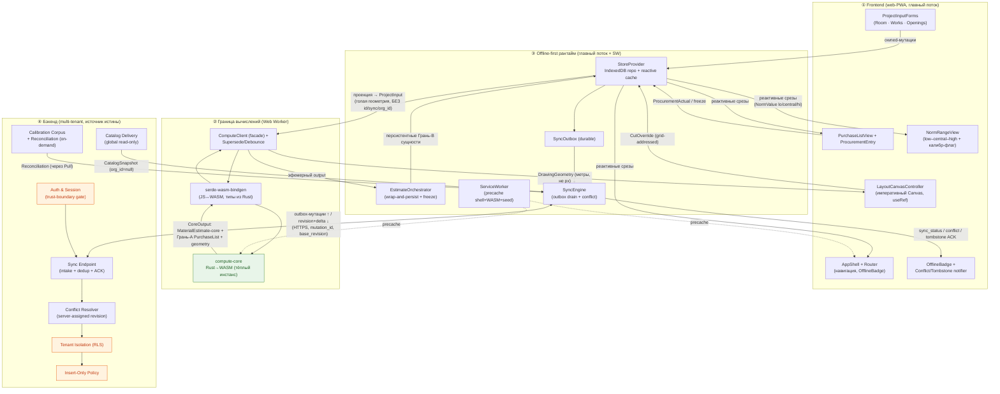
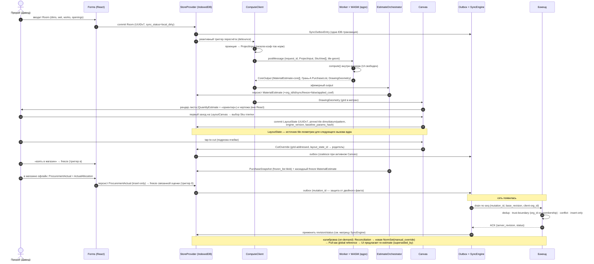

# 09 · Архитектура приложения

> Глава дизайн-дока. **Только дизайн** — слои, компоненты, границы, потоки данных.
> Не код, не реализация. Согласовано с гл. 05 (модель данных + контракт ядра §8) и
> гл. 07 (нормы = диапазон + калибровка). Стек и инвариант `compute-core` — гл. 03;
> решения D1–D10 — гл. 04.

Эта глава отвечает на вопрос «как физически разложено приложение»: какие слои, что
каждый из них умеет и чего НЕ умеет, как данные пересекают границы, и как один
сценарий (прораб ввёл комнату → лист и чертёж → правки и факт → синк) проходит
насквозь. Главный архитектурный инвариант — **чистое ядро отдаёт ДАННЫЕ, а не
пиксели, и не видит identity/sync/persistence** (D2, гл. 05 §8) — здесь отражён
физической раскладкой слоёв, а не дисциплиной.

---

## 0. Карта слоёв (одним взглядом)

Пять слоёв, два барьера. Барьеры — это места, где архитектура обязана не «протечь»:

1. **Frontend (React-оболочка + императивный Canvas)** — формы, списки, навигация,
   рендер чертежа и листа. React держит оболочку; плотная графика — на Canvas вне
   React-ререндера (D2/D4).
2. **Граница вычислений (Web Worker + Rust→WASM `compute-core`)** — тяжёлый счёт вне
   UI-потока. Барьер №1 (поток↔поток) и барьер №2 (JS↔WASM) живут здесь.
3. **Offline-first рантайм (IndexedDB-store + outbox + sync-клиент)** — единственный
   источник истины для UI на клиенте; данные рождаются здесь офлайн (гл. 05 §9).
4. **Бэкенд (multi-tenant API + sync + trust-boundary + каталог)** — источник истины
   на сервере; ставит `org_id` из membership, назначает `revision`, держит
   calibration-корпус (гл. 05 §10).
5. **Сборка/тулчейн (Vite + wasm-pack + type-gen)** — сквозной слой: гарантирует, что
   единая доменная модель (D3) пересекает Rust↔TS без ручного дрейфа, а `.wasm` и
   seed работают офлайн.

Зелёным выделено **чистое ядро** (без identity/sync); оранжевым — **trust-boundary**
(сервер не доверяет клиентскому `org_id`). Две стрелки между ③ и ④ — единственный
сетевой путь; всё остальное работает офлайн.

---

## 1. Ответственность слоёв, компоненты, технологии

### ① Frontend — web-PWA

**Зачем слой.** Единственный человекозаполняемый вход (геометрия + работы), рендер
выхода ядра (лист + чертёж), честная презентация неопределённости. React держит
оболочку; плотная графика — императивный Canvas вне React-ререндера (причина
залипаний №1 — счёт и тяжёлый рендер на главном потоке).

| Компонент | Ответственность | Технологии |
|---|---|---|
| **AppShell + Router** | Маршруты экранов (ProjectList → ProjectDetail → RoomEditor → LayoutCanvas → PurchaseList → ProcurementEntry), глобальный layout, OfflineBadge/SyncStatus в шапке, PWA install-prompt. Lazy-загрузка тяжёлых модулей (Canvas, wasm-glue) — лёгкий первый paint. Калибровочный результат (Reconciliation, on-demand) и CTA re-estimate под новой NormSet — на ProjectDetail, не отдельный экран на пилоте. | React 18 + Vite + react-router; vite-plugin-pwa; code-split по маршруту. |
| **ProjectInputForms** (Room · WorkSelection · Opening) | Единственный человекозаполняемый вход (гл. 05 §2): геометрия, состав работ галочками, проёмы. Шаблон по `RoomType` предзаполняет → прораб правит дельту (`measurement_source` provenance сохраняется). Валидация физики (положительные размеры, проём ≤ стены). `template_default`-комнаты помечены «не замерено» (low-trust, исключены из фита). | React controlled forms; крупные таргеты под палец/перчатку; локальный draft → commit в StoreProvider. |
| **LayoutCanvasController** | Императивный рендер чертежа (D2/D4/D8): потребляет `DrawingGeometry` (baseline grid в метрах + overrides — ДАННЫЕ, не пиксели), рисует через `requestAnimationFrame` вне React. Hit-testing тапа → логический адрес ячейки (`cell_col/cell_row`, стабилен под zoom/pan), не пиксель. Tap-to-cut/suppress/annotate → эмитит `CutOverride`-as-data в store, НЕ мутирует геометрию ядра. Pilot рендерит только `pattern=grid`. | Plain Canvas 2D через `useRef`; draw-loop в imperative-модуле; координатная трансформация метры↔px; сверка `baseline_params_hash`. |
| **PurchaseListView + ProcurementEntry** | List: эфемерная Грань-A по этапам (`by_stage`), per-line `quantity: QuantityEstimate{low/expected/high}` + `packs` (`PackEstimate`, ceil-диапазон) + `line_total` (`MoneyRange`, метка «ориентир» — D10). Рендерит **`QuantityEstimate.confidence ∈ {exact, estimated, wide}`** и `MoneyRange.is_estimate` — это confidence уровня КОЛИЧЕСТВА, не уровня нормы (гл. 05 §5). «Взять в магазин» → freeze → PurchaseSnapshot. Entry: ручной `ProcurementActual` (часто офлайн в магазине) → `ActualAllocation` (фан-аут факта на 1+ оценку). Self-confirmation guard визуализирован (`estimated_by_david`/`rough` = non-narrowing). | React списки + формы; интеграция с EstimateOrchestrator для freeze. |
| **NormRangeView** | Презентация честной неопределённости НОРМЫ (гл. 07, D7): `NormValue` как low–central–high, НЕ ложно-точная цифра. Рендерит **`NormValue.confidence ∈ {high, medium, low, unvalidated}`** (гл. 05 §3) → бейдж/цвет — это confidence уровня НОРМЫ, отдельный энум от количественного выше. Калибровочный флаг для high-variance материалов (стяжка/клей/затирка-по-шву/краска): «диапазон до калибровки — уточни по пробному участку/первому слою». `central` драйвит дефолт листа; `unvalidated` подсвечен. Используется в норм-вью/тултипе допущений, не в строках листа. | React presentational (stateless); тултип с `NormAssumptions` (зубец/паттерн/% запаса). |
| **OfflineBadge + Conflict/Tombstone notifier** | Видимое состояние офлайн-first: агрегат `sync_status`, online/offline индикатор, счётчик непушнутых правок. LWW-with-warning тост при конфликте, «удалено» при tombstone-выигрыше — неблокирующе, без merge-UI. | React presentational; подписка на SyncEngine + агрегат из StoreProvider. |

### ② Граница вычислений — Web Worker, хостящий Rust→WASM `compute-core`

**Зачем слой.** Перенести контракт ядра `compute(ProjectInput) → {MaterialEstimates,
Грань-A PurchaseList, geometry}` (гл. 05 §8) через два барьера (поток↔поток, JS↔WASM)
без блокировки UI, не протащив identity/sync/persistence внутрь ядра и не дав ядру
вернуть пиксели наружу. App резолвит эффективные коэффициенты норм ДО вызова — ядро
остаётся чистым.

| Компонент | Ответственность | Технологии |
|---|---|---|
| **ComputeClient** (main-thread facade) | Единственная точка входа App в вычисления. Собирает `ProjectInput` из персистентных сущностей (Room→RoomInput, резолв эффективных коэффициентов в плоский набор, каталог→`Vec<SkuView>`), присваивает `request_id`, шлёт в Worker, возвращает Promise. Бизнес-логики расчёта НЕ содержит — только маршалинг + lifecycle. | TypeScript, тонкий класс; типы запроса/ответа из Rust (ts-rs/tsify). |
| **Worker Host** (`compute.worker.ts`) | Единственный владелец инстанса WASM. Грузит/инстанцирует `.wasm` один раз, держит тёплым между вызовами. Слушает `onmessage`, вызывает экспорт WASM **синхронно внутри воркера** (UI свободен), ловит панику/ошибку, постит результат с тем же `request_id`. Не знает про React/DOM/IndexedDB. | TS в module Worker (`type:'module'` для vite-plugin-pwa); wasm-bindgen `init()`. |
| **Serde Bridge** | Граница JS↔WASM: `ProjectInput` (de)serialize через serde-wasm-bindgen. Контракт §8 пересекает как ДАННЫЕ, не opaque-указатели. Держит инварианты: integer money (`amount_minor_units` — без f64-drift) и unit-invariant (отвергает SkuView где `pack_unit ≠ base_unit` без `coverage_per_pack`). | Rust: `#[wasm_bindgen]` + serde-wasm-bindgen; tsify/ts-rs зеркалит TS-типы. |
| **Request Coordinator / Supersede** | Ре-вызов ядра при правках входов без гонок: монотонный `request_id`/generation per project. Ответ с `request_id < current` отбрасывается (LWW по generation — UI не увидит откат к старому). Debounce/coalesce быстрых правок (типизация размеров) перед отправкой. Single in-flight на проект достаточно для пилота. | TS на главном потоке; generation-счётчик; debounce-таймер. |
| **Geometry Output Contract** | Форма выхода для Canvas — НЕ пиксели/SVG (D2): baseline grid (`cols/rows/cells` в МЕТРАХ) + применённые overrides. Маппинг метры→px (pan/zoom) делает рендерер, не ядро. | Rust serde-структура → JS-объект через мост. |
| **WASM Bootstrap / Asset wiring** | `.wasm` precache через vite-plugin-pwa (Workbox) → ядро доступно офлайн на стройке (D1). Версия артефакта (`engine_version`) согласована с `LayoutState.engine_version` и `baseline_params_hash` (гл. 05 §6) — апгрейд ядра инвалидирует stale layout-overrides осознанно. | Vite + vite-plugin-pwa; wasm-pack/wasm-bindgen output. |

### ③ Offline-first рантайм — IndexedDB + outbox + sync-клиент

**Зачем слой.** Данные рождаются в IndexedDB офлайн (гл. 05 §9). Слой связывает чистое
ядро (Грань-A, без identity) с сервером (источник истины) через durable outbox +
server-assigned revision.

| Компонент | Ответственность | Технологии |
|---|---|---|
| **StoreProvider** (IndexedDB repo + reactive cache) | Единственный источник истины для UI на клиенте. Оборачивает Грань-B сущности (Project/Room/MaterialEstimate/LayoutState/CutOverride/ProcurementActual/PurchaseSnapshot + Sku/NormSet-кэш). Каждая owned-мутация: client-mint UUIDv7 + SyncMeta (`sync_status=local_dirty`, `base_revision=last_synced_revision`) + запись в IndexedDB И в SyncOutbox **одной транзакцией** (durability-инвариант: нет записи без enqueued мутации). НЕ выдумывает `revision`. НЕ ставит `org_id` из UI-доверия. Insert-only классы (frozen MaterialEstimate, PurchaseSnapshot, NormSet, recorded ProcurementActual) — UI блокирует редактирование. | TypeScript; IndexedDB через idb/Dexie-обёртку, object-store per entity_type + индексы `org_id/project_id/room_id/sync_status`; live-queries → React hooks. |
| **EstimateOrchestrator** (wrap-and-persist + freeze) | App-слой контракта гл. 05 §5/§8: `MaterialEstimate-core` → персистентный MaterialEstimate (+ `org_id`/`id`/SyncMeta/пин `norm_set_id`/`applied_coefficients`+`applied_assumptions` frozen-снапшот/`driving_measure_value`-снапшот). Грань-A PurchaseList НЕ персистит (ephemeral). **Три независимых триггера freeze MaterialEstimate (гл. 05 §3, Q#4):** (а) `Project.status ≠ planning`; (б) первый связанный `ProcurementActual` (факт морозит оценку); (в) создание `PurchaseSnapshot` («взять в магазин»). Любой → `frozen=true`, insert-only, re-estimate под новой нормой через `superseded_by`. PurchaseSnapshot хранит `frozen_list` blob; freeze каскадит на связанные MaterialEstimate. | TS; чистая трансформация core-output → entity; различает recompute (эфемерно) vs commit (персист). |
| **SyncOutbox** (durable queue) | Очередь офлайн-мутаций: `{seq, mutation_id, op, entity_type, entity_id, base_revision, payload-snapshot, attempt_count, last_error}`. Сам не несёт `org_id`/SyncMeta (local-only). | Отдельный IndexedDB store. |
| **SyncEngine** (outbox drain + apply) | Дренит outbox по `seq` при коннекте, at-least-once с `mutation_id`-дедупом, **push-before-pull в одном цикле** (outbox дренится ДО применения входящей дельты — pull не клоберит непушнутую правку). SyncEngine — про drain + apply ACK, не про authority конфликта (он на сервере, см. Граница D). Матрица ACK-`status` → действие: `applied`/`deduped` → применить server-assigned `revision`, `last_synced_revision++`, `sync_status=synced`, drop outbox-запись; `conflict` → LWW-with-warning неблокирующий тост; `tombstoned` → применить delete (delete-vs-update решён сервером); `rejected_immutable` → откат локальной правки до server-версии + neutral-notice (ожидаемая гонка freeze, не error); `rejected_tenant` → drop + лог (на N=1 не должно случаться — defense). Online/offline-детект → кормит OfflineBadge. | TS; `navigator.onLine` + ping; retry/backoff; debounce/coalesce при активном Canvas-редактировании. |
| **SyncPuller** (входящий синк) | Тянет дельту owned-строк (по revision-watermark) + глобальные reference (каталог/seed-нормы/шаблоны, read-only, `org_id=null`). Сливает в IndexedDB; устойчив к eventual referential integrity (висящая soft-ref не роняет). НЕ перезаписывает строку с `sync_status ∈ {local_dirty, syncing}` — откладывает до следующего цикла (страховка к push-before-pull). На пилоте N=1 (single-device) — тонкий pull: owned-строки org + reference + tombstones. Tombstone-resurrection-блокировка и watermark-курсорная дельта-merge на ВХОДЯЩЕМ конфликте — **deferred** под 2-е устройство (нет пилотного источника конкурентных записей); сам delete-vs-update резолвится на сервере (гл. 05 §10), клиент применяет присланный tombstone. | TS; pull по cursor/since-revision. |
| **ServiceWorker** | Precache app-shell + `.wasm` + версионированный bundled seed (каталог + seed-нормы + RoomTemplate) → приложение И расчёт работают полностью офлайн на стройке. Cache-first для shell+WASM; опц. Background Sync для дренажа outbox. НЕ кэширует owned-данные (это IndexedDB-территория). | vite-plugin-pwa (Workbox); `.wasm` как precached asset с hash в имени; cache-version ↔ `engine_version`. |
| **BootstrapProvisioner** | §9-инвариант identity: на fresh install без сети — silent auto-create Org(`solo`, `PT`, `EUR`, `pt-PT`) + User(Давид) + Membership(`owner`) с client-mint UUID, чтобы owned-строки сразу получили валидный `org_id`. На первом sync — attach реальной identity. Активный `org_id`/`user_id` отдаёт AppWrapper/ComputeBridge. **Локальный `org_id` оптимистичен; на write сервер перепроставит из membership** (trust boundary). Оговорка: trust-boundary полноценно применим ПОСЛЕ attach реальной identity — до первого sync membership локальна и серверу неизвестна (open Q#14). Пилотный shortcut (см. §4/§6): сервер принимает первый client-mint Org Давида как канонический (Дима не предсоздаёт Org), чтобы не ре-маппить `org_id` на уже-созданных строках. | TS; `device_id` — локальная константа в IndexedDB (Device-сущность на пилоте не материализуется). |

### ④ Бэкенд — multi-tenant API + sync + trust-boundary + каталог

**Зачем слой.** Источник истины на сервере. Ставит `org_id` из membership (НЕ из тела
запроса), назначает `revision`, дедупит по `mutation_id`, защищает ground-truth
(insert-only), хранит calibration-корпус. Сервер у Димы **уже есть** — дизайн
язык-нейтрален, конкретика RLS/insert-only зависит от стека (открытый вопрос ниже).

| Компонент | Ответственность | Технологии |
|---|---|---|
| **Auth & Session** (trust-boundary gate) | Верифицирует токен пушера → резолвит активную Membership → `SessionContext{user_id, org_id, role}`. **Единственный источник `org_id` для write и RLS** — никогда из тела запроса (гл. 05 §10). На пилоте — тонкий: внешний провайдер креды (stub `User.auth_provider`), одна owner-Membership Давида. | Рантайм сервера Димы; JWT/opaque-token; провайдер — отложен (local/otp достаточно). |
| **Sync Endpoint** (mutation intake) | Единая точка приёма outbox-мутаций. Для каждой: (1) дедуп по `mutation_id` (at-least-once → idempotent); (2) trust-boundary (стирает client-`org_id`, ставит из session); (3) Conflict Resolver (`base_revision`); (4) Insert-Only Policy; (5) на успех — `revision++` + ACK. Дренаж не по REST-per-row, а батч; parent может ещё не прийти — не роняет (мягкие FK, eventual integrity). | HTTP POST `/sync`; дедуп-таблица `applied_mutations` с TTL > max offline-окна. |
| **Conflict Resolver** | Optimistic concurrency по server-assigned `revision`: `base_revision` = текущей → применяет, `revision++`; не равны → конфликт. Пилот N=1: LWW-with-warning (применяет, помечает ACK `status=conflict`). Merge-UI/version-vector НЕ строятся (`lamport`/`device_id` reserved). | SQL: `UPDATE ... WHERE id=? AND revision=?` (compare-and-swap). |
| **Tenant Isolation (RLS)** | Изоляция тенантов одним предикатом `org_id = session.org_id` (гл. 05 §0, D9). На read — из серверной сессии, не из запроса. На write — отвергает/перезаписывает `org_id` вне membership. Глобальные reference (`org_id=null`) — read-only клиенту, write только curator. | PostgreSQL RLS + per-request `SET app.current_org_id`. |
| **Insert-Only Policy Enforcer** | Защита calibration-корпуса/ground-truth от тихой фальсификации (гл. 05 §10): для {NormSet, NormRule, Price, PurchaseSnapshot, frozen MaterialEstimate, recorded ProcurementActual} — create-once; upsert с иным payload → reject (НЕ LWW); повтор того же payload → no-op+ACK. Знает freeze-переход. | Политика в write-path + опц. DB-триггер (defense-in-depth); сравнение по нормализованному хешу. |
| **Pull / Delta Sync** | Отдаёт tenant-данные для офлайн-кэша: bootstrap + дельты по revision-watermark + tombstones. RLS-scoped. | HTTP GET `/sync/pull?since_revision=N`. |
| **Catalog Delivery** | Глобальный read-only каталог (Material/Sku/Store/Price) + RoomTemplate + seed-NormSet (`org_id=null`, `catalog_version`). Pull-only; bundled при первом запуске (~50–100 SKU). Price insert-only, current = `max(captured_at)`. | HTTP GET `/catalog?since_version=...`; bundled-снапшот в PWA-ассеты. |
| **Calibration Corpus Store** | Persistence пары estimate↔actual (Risk #1, D6): MaterialEstimate/ProcurementActual/ActualAllocation/Reconciliation. Хранит сырьё навсегда (insert-only) → авто-фит ретроспективно даже когда калибровка ручная. Линейная NormSet-цепь (`version`+`derived_from`); ручная калибровка = новая `NormSet(basis=manual_override)`. Хранит, не интерпретирует. | PostgreSQL с insert-only; append-only NormSet-цепь. |
| **Reconciliation** (идемпотентный, re-runnable) | Пересобирает пары estimate↔allocation когда оба конца доступны (гл. 05 §3), НЕ one-shot при вставке. Декомпозирует ошибку (per_unit / waste / assumption_delta / geometry_error → `error_attribution`+`weight`; weight=0 для self-confirmation guard). **На пилоте — on-demand / ручной триггер** (когда Дима/Давид садятся калибровать): сырьё estimate+actual+allocation персистится insert-only → пары пересобираются ретроспективно в любой момент, серверный standing post-sync джоб с cron/hook не нужен на N=1. Стоящий серверный джоб с авто-перезапуском — deferred под 2-й тайлер / авто-фиттер (тот же триггер, что CalibrationProfile). Размещение (on-demand скрипт vs клиент-в-Worker vs серверный hook) — open Q#16. | Детерминированная декомпозиция (шарит формулы-семантику с ядром, но это app/server-only); на пилоте — скрипт/on-demand пересчёт. |
| **Curator Admin** | Привилегированный write reference-данных: курирование каталога (~50–100 SKU вручную, D10), публикация seed-NormSet, RoomTemplate. Единственная роль, которой RLS разрешает писать `org_id=null`. Price append-only. На пилоте — Дима через seed-скрипт, не публичная B2B-админка. | Admin-endpoint/скрипт с curator-ролью. |

### ⑤ Сборка/тулчейн (сквозной слой)

**Зачем слой.** Гарантирует D3-инвариант «единая модель без двойного определения» и
офлайн-готовность `.wasm`. Подробности — гл. 03 (стек) и ниже в §3.

- **Монорепо:** `crates/compute-core` (Rust, src-of-truth контракта §8) · `packages/core-bindings` (wasm + glue + `.d.ts`) · `packages/core-types` (сгенерённые TS-типы) · `apps/pwa` (React+Vite) · `apps/backend` (сервер Димы). JS = pnpm-workspace, Rust = cargo-workspace; мост = шаг сборки `core-bindings`. Границы (D2) физически отражены деревом каталогов: типов §1/SyncMeta/Грань-B в `crates/compute-core` просто НЕТ → инвариант проверяется компилятором, не дисциплиной.
- **wasm-build:** wasm-pack/wasm-bindgen → один артефакт, две точки потребления (PWA-воркер + headless-PDF на Node).
- **type-gen:** tsify (предпочтительно — на границе) или ts-rs → TS-типы из Rust. Меняешь поле в Rust → TS-тип меняется → фронт перестаёт компилиться, если не подхватил.
- **dev-loop:** два контура скорости — нативный `cargo test` для логики норм (секунды, без браузера) + Vite-HMR для UI; `.wasm` пересобирается ТОЛЬКО при изменении контракта (прямая митигация принятого в D3 трейд-оффа «медленнее итерация через FFI»).

---

## 2. Границы и контракты

Четыре границы, через которые проходят данные. Каждая определена ТЕМ, что через неё
пересекает, и — не менее важно — тем, что НЕ пересекает.

### Граница A — UI ↔ ядро (главный поток ↔ Worker ↔ WASM)

Самая инвариантная граница (D2, гл. 05 §8). Два физических барьера, один логический
контракт.

**Вниз (App → ядро), ЧИСТЫЕ ДАННЫЕ, не персистентные:**
- `ProjectInput` — голая геометрия: `rooms: Vec<RoomInput{length/width/height_m, type, wet, openings, works}>` **БЕЗ** `id`/sync/`org_id`/status/`measurement_source`/notes.
- Резолвнутый **плоский** набор эффективных норм-коэффициентов (`NormRule` с `per_unit`/`waste_factor`/`assumptions`) — **app сходил в калибровку ДО вызова**; ядро получает готовое.
- Каталог-вью `Vec<SkuView{material_key, pack_size, pack_unit, coverage_per_pack?, current_price_minor_units, availability}>` — app проецирует §4 (ядро не знает Store/Price-историю).
- Tile-геометрия: `tile_width/height_m`, `datum`, `pattern`, `Vec<CutOverride-as-data>`.

**Вверх (ядро → App), ЭФЕМЕРНЫЙ, recomputable, БЕЗ identity/sync:**
- `Vec<MaterialEstimate-core>{material_key, stage, driving_measure_value, quantity: NormValue, unit, norm_set_id, applied_coefficients, applied_assumptions}` — **без SyncMeta**. `NormValue` несёт `confidence ∈ {high, medium, low, unvalidated}` (уровень НОРМЫ → NormRangeView).
- Грань-A `PurchaseList` (`by_stage`, `PurchaseItem` с `quantity: QuantityEstimate{low/expected/high, confidence ∈ {exact, estimated, wide}}` / `PackEstimate` / `MoneyRange{is_estimate}`). **Два РАЗНЫХ confidence-энума** (гл. 05 §5): `NormValue.confidence` (норма) и `QuantityEstimate.confidence` (количество в листе) — не путать; PurchaseItem НЕ несёт `NormValue.confidence`.
- `DrawingGeometry` — baseline grid (`cols/rows/cells` в **метрах**) + overrides → данные для Canvas, **НЕ пиксели**.

**Инварианты на границе (гл. 05 §8):**
- **Range-composition — ОДНА документированная функция** (Rust↔TS детерминизм):
  `quantity.central = driving × per_unit.central × (1 + waste.central)`; границы — `per_unit` несёт основную неопределённость, `waste` как скалярная полоса поверх; НЕ перемножать `lo×lo`/`hi×hi` независимо (компаундит в бессмысленно-широкий hi, обнуляет `within_range`).
- **Integer money** — `amount_minor_units` (i64/центы), без f64-drift через serde.
- **Unit-invariant** — ядро отвергает SkuView где `pack_unit ≠ base_unit` без `coverage_per_pack` (вместо тихого mis-round).
- **Panic-safety** — паника Rust ловится в воркере, не убивает приложение (graceful error наружу).

**НЕ пересекает границу к ядру (инвариант, отражённый деревом каталогов):** весь §1
identity/tenancy, ВСЕ SyncMeta-поля, catalog-STORAGE (Store/Price-история/
`catalog_version`/curation), вся Грань-B (PurchaseSnapshot/ProcurementActual/
ActualAllocation/Reconciliation), резолв калибровки, template-provenance, статусы.

> Управляющие метаданные (не доменные) на барьере поток↔поток: `request_id`/generation
> для supersede, `status ∈ {ok, error, panic}` для обработки сбоя ядра.

### Граница B — UI ↔ персистентность (wrap-and-persist)

App-слой оборачивает выход ядра (контракт гл. 05 §5/§8). Эфемерный
`MaterialEstimate-core` → персистентный `MaterialEstimate` (+ `org_id`/`id`-UUIDv7/
SyncMeta/freeze/`applied_coefficients`-frozen-снапшот/`driving_measure`-снапшот).
Грань-A PurchaseList → PurchaseSnapshot (`frozen_list` blob) **только при freeze**.
Эфемерный план и immutable ground-truth — разные lifetimes (гл. 05 §5).

### Граница C — Canvas ↔ персистентность

`CutOverride` как ДАННЫЕ, адресованные grid-координатами (`cell_col/cell_row`), НЕ
пикселями; `CanvasViewport` (pan/zoom) отдельно от геометрии. Геометрия ядра НЕ
мутируется правкой — overrides = diff поверх recomputed baseline. Stale-detection
через `baseline_params_hash`: при несовпадении overrides помечаются stale, не misapply
(гл. 05 §6).

### Граница D — клиент ↔ сервер (sync, trust-boundary)

**Вверх (SyncEngine → сервер):** `SyncOutboxEntry{mutation_id, op, entity_type,
entity_id, base_revision, payload-snapshot}` с client-mint UUIDv7 и **клиентским
`org_id`, который сервер ИГНОРИРУЕТ**. Bearer-токен в заголовке. `mutation_id` →
at-least-once идемпотентность.

**Вниз (сервер → клиент):**
- write-ACK: `{mutation_id, entity_id, server_assigned_revision, status ∈ {applied, deduped, conflict, rejected_immutable, rejected_tenant, tombstoned}}` — `status` драйвит outbox (удалить/повторить/предупредить).
- read-delta: изменённые owned-строки данной org (полный реплицируемый SyncMeta) + tombstones + `max_revision`.
- reference: `CatalogSnapshot` (глобальные read-only, `org_id=null`, `catalog_version`).

**Инвариант trust-boundary:** на write сервер стирает client-`org_id` и ставит из
аутентифицированной membership (или отвергает строку с `org_id` вне membership). На
read — RLS-предикат из серверной сессии. `sync_status`/`last_synced_revision` — только
клиент, не реплицируются.

**НЕ пересекает к серверу:** Грань-A PurchaseList как персистентная сущность (она
ephemeral, recompute в WASM). Серверу пересекает только Грань-B —
`PurchaseSnapshot.frozen_list` (opaque JSON-blob точного Грань-A payload на момент
freeze, самодостаточен для воспроизводимости БЕЗ `catalog_version`-lookup).

---

## 3. Сквозной поток данных — трасса одного сценария

Один прогон: **прораб ввёл комнату → Worker посчитал через WASM → лист и чертёж
отрендерились → правки чертежа и факт закупки сохранились в IndexedDB → синк на
бэкенд.** Номера шагов в диаграмме соответствуют тексту.

**Развёрнуто по фазам:**

1. **Ввод комнаты (офлайн).** Давид заполняет Room в ProjectInputForms: dims с
   дальномера, `wet`, галочки работ, проёмы. Шаблон по `RoomType` уже предзаполнил —
   он правит дельту. Commit → StoreProvider минтит UUIDv7, ставит SyncMeta
   (`sync_status=local_dirty`, `base_revision=last_synced_revision`), пишет Room **и**
   SyncOutboxEntry одной IDB-транзакцией. Реактивный слой триггерит пересчёт (debounce,
   чтобы не молотить ядро на каждый keystroke).

2. **Проекция и вызов ядра.** ComputeClient проецирует персистентный Room →
   `RoomInput` (голая геометрия, БЕЗ id/sync/org_id), **резолвит эффективные
   коэффициенты норм** в плоский набор (на пилоте = копия base NormRule), проецирует
   каталог → `Vec<SkuView>`, присваивает `request_id`, шлёт в Worker через postMessage.

3. **Счёт в WASM (вне UI-потока).** Worker Host вызывает `compute()` синхронно внутри
   воркера — главный поток свободен, UI не залипает. Ядро применяет range-composition
   (одну документированную функцию, гл. 05 §8 / гл. 07): `central = driving × per_unit
   × (1 + waste)`, возвращает `CoreOutput` — `MaterialEstimate-core[]` + Грань-A
   PurchaseList + `DrawingGeometry` (baseline grid в метрах). Stale-ответ (`request_id <
   current`) отбрасывается.

4. **Wrap-and-persist + рендер.** EstimateOrchestrator оборачивает
   `MaterialEstimate-core` → персистентный MaterialEstimate (+ `org_id`/`id`/SyncMeta/
   `frozen=false`/`applied_coefficients`-снапшот/`driving_measure`-снапшот), пишет в
   StoreProvider. Грань-A PurchaseList **не персистится** — живёт в памяти UI.
   - **Лист** рендерится PurchaseListView: по этапам, per-line `QuantityEstimate`
     (low–expected–high) + `QuantityEstimate.confidence`-бейдж (`exact/estimated/wide`)
     + `PackEstimate`, `line_total` (`MoneyRange.is_estimate`) помечен «ориентир» (D10).
     Норм-уровень неопределённости (`NormValue.confidence` + калибровочный флаг
     high-variance, гл. 07) показывает NormRangeView в норм-вью/тултипе допущений — это
     ДРУГОЙ confidence-энум, не строки листа.
   - **Чертёж** рендерится LayoutCanvasController из `DrawingGeometry`: маппинг
     метры→px, draw-loop вне React. Pilot — только `pattern=grid`.

5. **Открытие чертежа и источник tile-геометрии (офлайн).** Первый заход на
   LayoutCanvas требует выбранной плитки: Давид выбирает `Sku` → StoreProvider создаёт
   **LayoutState** (pinned `tile_width/height_m` из Sku, `datum`=corner-default,
   `pattern=grid`, `engine_version`, `baseline_params_hash`). Это родитель-агрегат и
   ИСТОЧНИК tile-геометрии для следующего вызова ядра (без выбранного Sku
   `LayoutState.sku_id` nullable → ядро не может вернуть `DrawingGeometry`; UI до выбора
   показывает placeholder-сетку, open Q#5). Только после commit LayoutState идёт правка.

6. **Правка чертежа (офлайн).** Давид тапает ячейку (подрезка). Canvas hit-test →
   логический `cell_col/cell_row` (не пиксель) → эмитит `CutOverride`-as-data
   (`layout_state_id` → родитель LayoutState) в StoreProvider. Геометрия ядра НЕ
   мутируется — override это diff поверх baseline. Outbox coalesce-ит частые правки.
   **Stale-механика при изменении размеров комнаты:** при reactive-recompute
   LayoutCanvasController сверяет `baseline_params_hash` свежего core-output с сохранённым
   `LayoutState.baseline_params_hash`; mismatch → **app-слой (Canvas/Store), не ядро**,
   ставит затронутым `CutOverride.superseded_by_baseline=true`, рендерит baseline без них
   и показывает баннер «N подрезок устарели после изменения размера» (политика авто-reapply
   vs ручное подтверждение — open Q#3).

7. **Freeze и факт закупки (офлайн в магазине).** «Взять в магазин» → freeze (триггер
   в): Грань-A PurchaseList → PurchaseSnapshot (`frozen_list` blob), каскадный freeze
   связанных MaterialEstimate (`frozen=true` → insert-only). В магазине Давид вводит
   `ProcurementActual` (часто без сети) → `ActualAllocation` (фан-аут факта на 1+
   оценку; single-room → авто-`ActualAllocation(consumed_fraction=1.0)`, >1 комната →
   ручной split — UI предлагает связать факт с frozen MaterialEstimate того же
   material/stage в проекте). **Записанный `ProcurementActual` — insert-only** (гл. 05
   §10): create-once, правка факта = новая запись/коррекция, не upsert. Он же — **второй
   независимый триггер freeze** (б): если факт записан БЕЗ предварительного
   PurchaseSnapshot, он всё равно морозит связанную оценку (insert-only переход).
   `mutation_id` на outbox-записи защищает от двойного факта при потерянном ACK (двойной
   факт = испорченный reconcile, Risk #1).

8. **Синк на бэкенд (сеть появилась).** SyncEngine дренит outbox по `seq`
   (push-before-pull). Сервер: дедуп по `mutation_id` → trust-boundary (стирает
   client-`org_id`, ставит из membership) → Conflict Resolver (`base_revision`) →
   Insert-Only Policy → `revision++` + ACK. Клиент применяет ACK по матрице SyncEngine
   (`applied`/`deduped` → revision + `synced`; `conflict` → LWW-тост; `rejected_immutable`
   → откат локальной правки + neutral-notice; `tombstoned` → delete). Затем pull дельты
   (НЕ клоберит local_dirty/syncing строки).

9. **Замыкание калибровочной петли (Risk #1).** Reconciliation (on-demand, когда Дима
   садится калибровать) декомпозирует ошибку estimate↔actual. Замороженные
   MaterialEstimate пинят СТАРЫЙ `norm_set_id` и insert-only — поэтому петля замыкается
   не правкой, а новой версией: Curator (Дима) публикует `NormSet(basis=manual_override)`
   с откалиброванными коэффициентами → она доезжает на клиент через SyncPuller как
   global reference (`org_id=null`) → UI на ProjectDetail предлагает re-estimate
   (создаёт НОВЫЙ MaterialEstimate с `superseded_by` на старый и `applied_coefficients`
   из калиброванной версии; старый замороженный остаётся в corpus). Это и есть тот самый
   CTA калибровочного флага (open Q#4) — петля Risk #1 замкнута, а не разомкнутая
   стрелка.

**Почему цифры на чертеже, в листе и в PDF не расходятся:** все три берут ОДИН выход
ОДНОГО ядра (один `.wasm`, одна доменная модель). Headless-PDF-путь зовёт тот же
артефакт — расхождение невозможно by construction (гл. 03 инвариант, §3 «тот же модуль
крутится headless»).

---

## 4. Offline-first механика

Офлайн на стройке — не B2B-фича, а базовый UX пилота (D1). Что именно работает без
сети и за счёт чего.

**Полностью офлайн (без единого запроса к серверу):**
- Запуск приложения — ServiceWorker precache app-shell.
- **Расчёт** — `.wasm` precache'ится → ядро считает нормы/геометрию офлайн.
- Seed-данные — bundled каталог (~50–100 SKU) + seed-нормы + RoomTemplate в precache → лист и оценки строятся при первом запуске даже без сети.
- Identity — BootstrapProvisioner silent auto-create Org+User+Membership(owner) офлайн (гл. 05 §9). До первого sync membership локальна и серверу неизвестна — trust-boundary полноценен после attach identity (open Q#14).
- Создание/правка Project/Room/MaterialEstimate/LayoutState/CutOverride; **три триггера freeze** (status≠planning ИЛИ первый связанный ProcurementActual ИЛИ PurchaseSnapshot); ввод ProcurementActual+ActualAllocation (записанный факт — insert-only) — всё рождается в IndexedDB.

**Durability и доставка:**
- **Durable outbox:** каждая owned-write пишет сущность **и** SyncOutboxEntry одной IDB-транзакцией → нет записи без enqueued мутации. Дренаж по `seq` (replay order) при коннекте; триггеры — online-событие, опц. Background Sync API, foreground-таймер.
- **Идемпотентность:** at-least-once + `mutation_id`-дедуп на сервере → потерянный ACK на стройке + retry = no-op+повторный ACK (а не двойной факт).
- **Server-assigned revision:** клиент НЕ выдумывает следующий номер; конфликт = `base_revision ≠` серверной revision. Authority конфликта — на сервере; клиент применяет ACK. На пилоте N=1 single-device — LWW-with-warning, неблокирующий тост, без merge-UI.
- **Обработка reject/конфликта на клиенте (матрица ACK-status):** `applied`/`deduped` → drop outbox + apply revision; `conflict` → LWW-тост; `rejected_immutable` → откат локальной правки до server-версии + neutral-notice (ожидаемая гонка freeze: локально ещё не frozen, на сервере уже — НЕ error); `rejected_tenant` → drop + лог (defense; на N=1 не должно случаться); `tombstoned` → применить delete.
- **Push-before-pull:** в одном sync-цикле outbox дренится ДО применения входящей дельты, и pull НЕ перезаписывает строку с `sync_status ∈ {local_dirty, syncing}` (откладывает до следующего цикла) → непушнутая локальная правка не теряется.
- **Tombstone:** soft-delete синкается; delete-vs-update резолвится на СЕРВЕРЕ (гл. 05 §10: delete по более новой server-revision выигрывает, resurrection блокируется) — клиент лишь применяет присланный `tombstoned`-ACK/read-delta tombstone.

**Что только онлайн (best-effort, не блокирует работу):**
- Реальный sync (push/pull) — копится в outbox до сети.
- Свежий каталог/цены — на пилоте «низкая свежесть ок» (D10 «цена-ориентир»); bundled seed покрывает первый офлайн-старт.
- Калибровка: новая `NormSet(manual_override)` публикуется Куратором (Дима, on-demand) и доезжает на клиент через Pull как global reference; UI предлагает re-estimate (`superseded_by`) — замыкание петли Risk #1.

**Identity на первом sync (пилотный shortcut):** до первого sync ВСЕ owned-строки несут
client-mint `org_id`. Чтобы не плодить дубль-Org и не ре-маппить `org_id` на уже-созданных
строках, на N=1 сервер принимает первый client-mint Org Давида как канонический (Дима не
предсоздаёт Org на сервере). Полноценный identity-claim/merge — deferred (open Q#14).

**Loading-состояние при вызове ядра (UI ↔ Worker):** пока Promise от ComputeClient не
зарезолвился, NormRangeView/PurchaseListView/Canvas показывают pending-skeleton («считаю…»);
самый долгий pending — холодный старт (WASM `init()` + первый compute). Stale-ответ
(`request_id < current`) отбрасывается тихо, без мелькания старых цифр. Spinner vs
прогресс-канал — open Q#8; сам факт loading-UI зафиксирован в дизайне.

**Риски офлайн-механики (детально — гл. 06):** IndexedDB-эвикшн под storage pressure
на дешёвом Android (нужен `navigator.storage.persist()`); раздувание cold-install по
слабой LTE (`.wasm` + seed — разделить critical-path precache и lazy); TTL дедуп-окна
`mutation_id` ≥ max-офлайн-окна Давида (объект может быть без сети значительно дольше
дефолтов); связка SW-cache-version ↔ `engine_version` ↔ `baseline_params_hash` — единая
точка, легко рассинхронить.

---

## 5. Pilot vs deferred

Принцип (как в гл. 05): **LEAN для N=1, но tenant-ready и offline-ready** — границы,
которые дорого ретрофитить (trust-boundary, RLS, insert-only, range-composition,
единая модель D3), закладываются сразу; механика, у которой на N=1 нет сценария
(merge-UI, solver, авто-фиттер), спроектирована, но не строится.

### Строим на пилоте

**Frontend:** React-оболочка + роутинг; ProjectInputForms (шаблон + правка дельты,
provenance); LayoutCanvasController императивный, ТОЛЬКО `pattern=grid`, tap-to-edit
CutOverride (grid-addressed), pan/zoom; NormRangeView (low–central–high + confidence +
калибр-флаг, `unvalidated` подсвечен); PurchaseListView по этапам + «ориентир» (D10) +
freeze; ProcurementEntry офлайн + ActualAllocation фан-аут + self-confirmation guard
визуально; OfflineBadge + conflict/tombstone notifier.

**Вычисления:** один тёплый WASM-инстанс в одном Worker; sync-вызов ядра внутри
воркера; serde-wasm-bindgen + ts-rs/tsify (единая модель); generation-supersede +
debounce; integer money + unit-invariant enforce; geometry наружу как baseline-grid в
метрах; panic-safety; `.wasm` precache.

**Рантайм/sync:** IndexedDB под ~16 pilot-core сущностей + SyncMeta + local-only;
client-mint UUIDv7 + soft-ref FK; durable outbox (атомарно с write); drain по `seq` +
server-assigned revision + `mutation_id` дедуп + retry/backoff; **push-before-pull** +
ACK-status-матрица (apply/conflict/rejected/tombstoned); insert-only классы на клиенте;
тонкий SyncPuller (owned-строки + reference + tombstones, без входящего merge-конфликта);
ServiceWorker (shell + WASM + bundled seed); BootstrapProvisioner (офлайн auto-provision).
ACK-статусы `conflict`/`tombstoned` держим в контракте (forward-compat), но conflict-UX
(notifier/тост) на single-device тестировать негде → см. deferred.

**Бэкенд:** Auth & Session тонкий (одна owner-Membership); Sync Endpoint батч + дедуп;
**server-assigned revision + `base_revision`-проверка** (compare-and-swap — trust/целостность,
cheap-now); trust-boundary; **RLS (дёшево заложить сразу — болезненно ретрофитить)**;
Insert-Only Policy; tombstone базовый (delete-vs-update резолвится сервером); Pull/Delta
тонкий; Catalog Delivery глобального read-only (~50–100 SKU, можно bundled); Calibration
Corpus + линейная NormSet-цепь (ручная калибровка через `manual_override`); **Reconciliation
on-demand** (ручной триггер при калибровке — сырьё insert-only, пары пересобираются
ретроспективно; standing серверный джоб НЕ нужен на N=1); curator-write = RLS-исключение
для `org_id=null`, дёргается seed-скриптом Димы (не component/админ-эндпоинт).

**Тулчейн:** монорепо `crates/` + `packages/` + `apps/`; нативный `cargo test` как
основной цикл норм; wasm-pack под один таргет; ОДИН механизм type-gen (tsify); Vite +
vite-plugin-pwa; dev-loop скрипты; **headless-PDF build-path на том же `.wasm`** (это
носитель пилотного выхода и инструмент валидации Risk #1, не отложенная фича);
golden-фикстуры `ProjectInput → CoreOutput` как контрактный якорь.

### Заложено, но позже (по триггеру)

| Deferred | Триггер |
|---|---|
| Merge-UI / version-vector / field-level конфликт (lamport/device_id reserved) + conflict-resolution UX (Conflict/Tombstone notifier, conflict-ACK-ветка) + входящий pull-merge (resurrection-блокировка, watermark-курсорная дельта) | 2-е устройство (телефон+планшет) |
| Standing серверный Reconciliation Job (cron/post-sync hook, авто-перезапуск) — сырьё уже копится insert-only, пилот считает on-demand | 2-й тайлер / авто-фиттер |
| Полноценный identity-claim/merge на первом sync (без коллизии client-mint Org с серверным) — пилот: сервер принимает client-mint Org как канонический | Реальная identity / 2-й пользователь |
| Solver-раскладка + рендер brick/herringbone/diagonal (intent персистится сейчас) | Фаза 2 |
| PurchaseLineSelection overlay (подмена SKU / исключение линий) | Давид начинает реально подменять |
| Авто-калибровка (Bayesian-фиттер) UI + per-material `min_samples` (сырьё копится сейчас) | 2-й тайлер / авто-фиттер |
| Bluetooth дальномер (Bosch GLM) | Пилот = ручной ввод чисел |
| ReorderPing / StageSchedule UI дозаказа | Реальная боль позднего дозаказа |
| Редактируемая позиция проёма на Canvas (нужен `Opening.id` + offset) | Canvas-редактирование проёма |
| Per-tenant catalog override · B2B-экраны (роли/админка/биллинг) | Дивергирующие B2B-каталоги / после валидации ядра |
| Device-реестр + tombstone-GC-движок | Multi-device |
| Worker pool · SharedArrayBuffer zero-copy · incremental recompute | Крупная геометрия / много комнат на телефоне Давида |
| CI-пайплайн · деплой PWA · TWA под Play Store · wasm-opt агрессивный | После устаканивания структуры / внешние пользователи |
| Полный i18n (PT/RU/EN) | Пилот = минимум PT для Давида |

---

## 6. Открытые вопросы (к реализации)

Дизайн фиксирует слои и контракты; следующие решения — implementation-time, перечислены
для трекинга (не блокируют дизайн). Полный список рисков — гл. 06.

**Frontend / Canvas:**
1. **Триггер пересчёта ядра:** на каждый keystroke, на blur, или явной кнопкой? Trade-off отзывчивость vs нагрузка Worker.
2. **Гранулярность outbox-coalesce при Canvas-редактировании:** сколько CutOverride батчить в одну outbox-запись vs per-edit (audit человек-vs-движок, гл. 05 §6). Нужна политика debounce-окна.
3. **Stale-CutOverride при изменении комнаты:** авто-re-apply по относительной позиции (долгосрочный фикс) vs ручное подтверждение прораба на пилоте.
4. **Формат калибровочного флага:** пассивный бейдж vs активный CTA «запусти пробный участок → введи факт → сузим диапазон» (замыкает петлю на ProcurementEntry/Reconciliation).
5. **Canvas без выбранного Sku плитки** (tile dims nullable до выбора): placeholder-сетка vs блокировка экрана? Влияет на порядок онбординга.

**Граница вычислений:**
6. **Panic-recovery:** `catch_unwind` на границе (ядро возвращает `Err`) vs re-instantiate воркером? Дисциплина ядра: panic=баг (никогда на валидном входе) + `Result` на невалидном.
7. **Гранулярность ре-вызова:** project-level `compute(project)` (пилот) vs per-room `compute(room)` когда комнат много (меняет форму контракта).
8. **Прогресс-канал от ядра:** нужен ли сейчас (forward-compat под solver фазы-2) или spinner→done хватает (расчёт быстр)?
9. **Детальность `CoreOutput.geometry`:** каждая плитка как cell с `x_m/y_m/w_m/h_m`+`is_cut` vs компактнее grid+exceptions (размер payload через границу).
10. **Integer money через границу:** i64 > 2^53 не влезает в JS number — number-предел для евро-сумм ремонта (пилот) vs BigInt/string-кодировка на будущее?

**Бэкенд / sync:**
11. **Backend-рантайм/стек** существующего сервера Димы — определяет, насколько дёшево RLS + insert-only триггеры (PostgreSQL?).
12. **Sync-протокол:** единый батч `/sync` (push+pull в один round-trip) vs раздельные push/pull с отдельным pull-курсором.
13. **Auth-провайдер на пилоте:** local/otp (phone-centric) достаточно для одного Давида?
14. **Identity claim/merge:** как attach реальной identity на первом sync без коллизии client-mint Org с серверным?
15. **`catalog_version`:** монотонный счётчик vs хеш-снапшот (влияет на дельта-pull и атрибуцию price-drift отдельно от norm-error).
16. **Reconciliation:** cron / post-sync hook / on-demand; клиентский (в Worker) vs серверный джоб (влияет на то, что синкается — только сырьё vs сырьё+Reconciliation).
17. **Дедуп-окно `mutation_id` + tombstone-retention:** TTL под реальное max-офлайн-окно Давида (объект может быть без сети значительно дольше дефолтов, ≥90 дней).

**Тулчейн:**
18. **tsify vs ts-rs** (или tsify-на-границе + ts-rs-для-бэкенда) — едут ли типы с wasm-glue или отдельным пакетом.
19. **wasm-pack `--target bundler` vs vite-plugin-wasm** — что лучше ложится на «wasm в Worker» + dev-loop watch.
20. **Один wasm-таргет на PWA+Node-PDF** vs два сборочных таргета.
21. **Подключение бэкенда Димы в монорепо:** submodule / `apps/backend` / внешний с импортом `core-types` (проходит ли D3-единая-модель до сервера).
22. **Коммитим сгенерённые артефакты** (`core-bindings` wasm, `core-types` .ts) в git vs собираем всегда (на N=1 — Дима один, пересборка ок).
